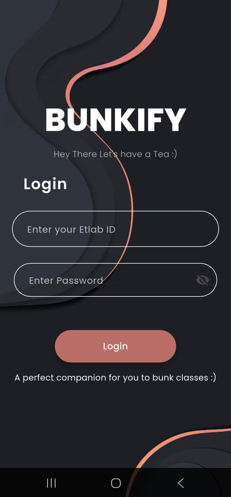
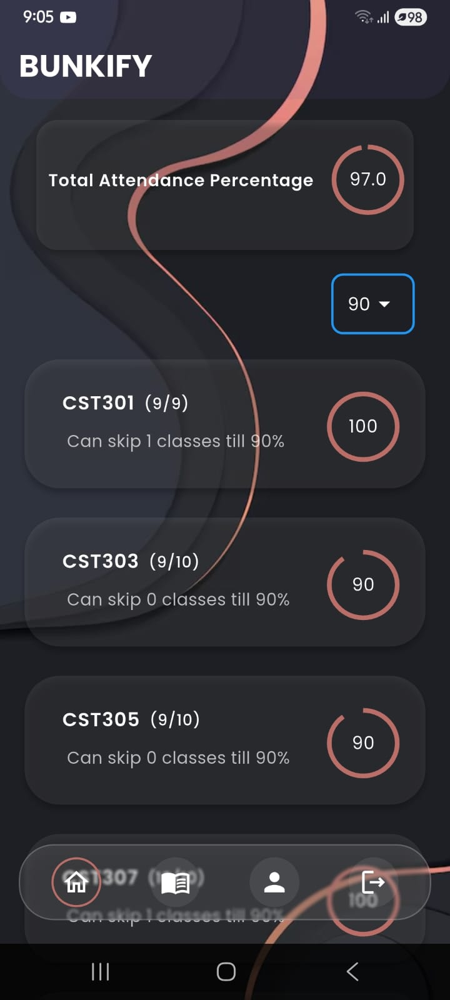
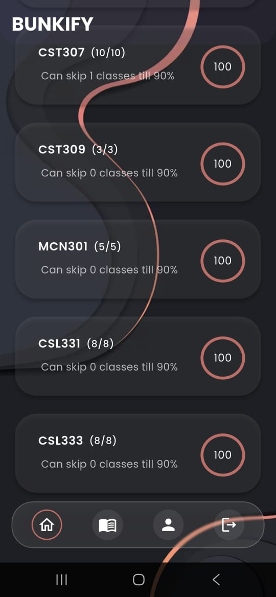
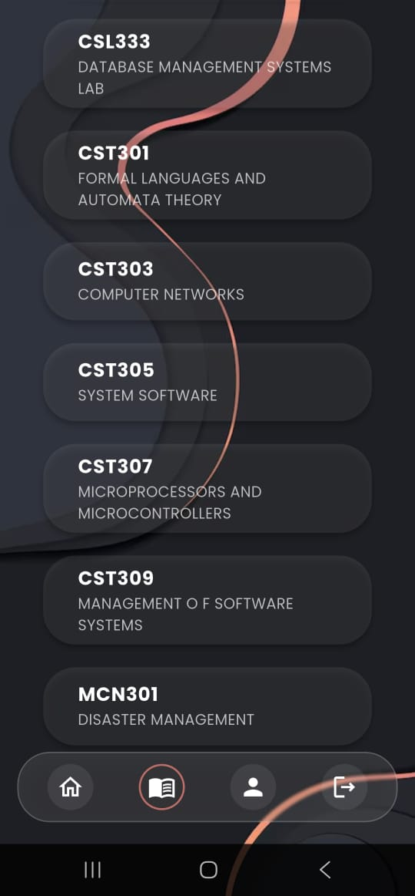
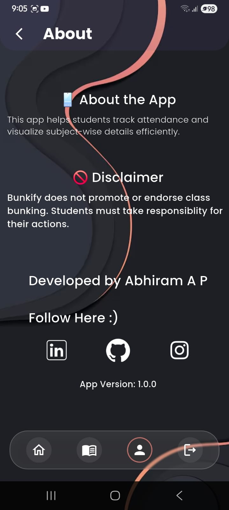

# 📱 Bunkify

Bunkify is a smart attendance companion app built with Flutter. It helps students track their attendance and calculate how many classes they can safely bunk without falling below a set attendance threshold. Designed with simplicity and utility in mind, Bunkify is a must-have tool for strategic bunkers.

---

## 🚀 Features

- 🎯 Set your target attendance percentage
- 📊 View total attended, conducted, and bunkable classes
- 🔄 Real-time calculation of how many classes you can skip
- 💡 Clean UI with a student-friendly experience

---

## Screens
                      

---

## 🛠 Tech Stack

- **Flutter** (Frontend)
- **Dart**
- **Python(Flask)**
- **BeautifulSoup,requests(Web Scraping)**
- **SharedPreferences**

---

