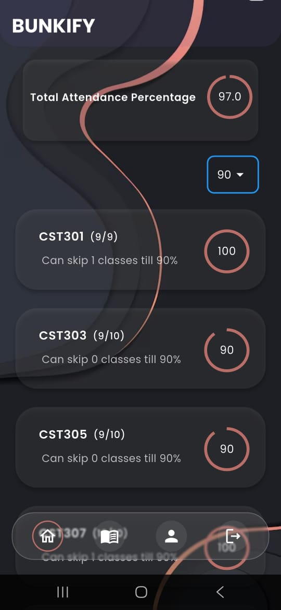
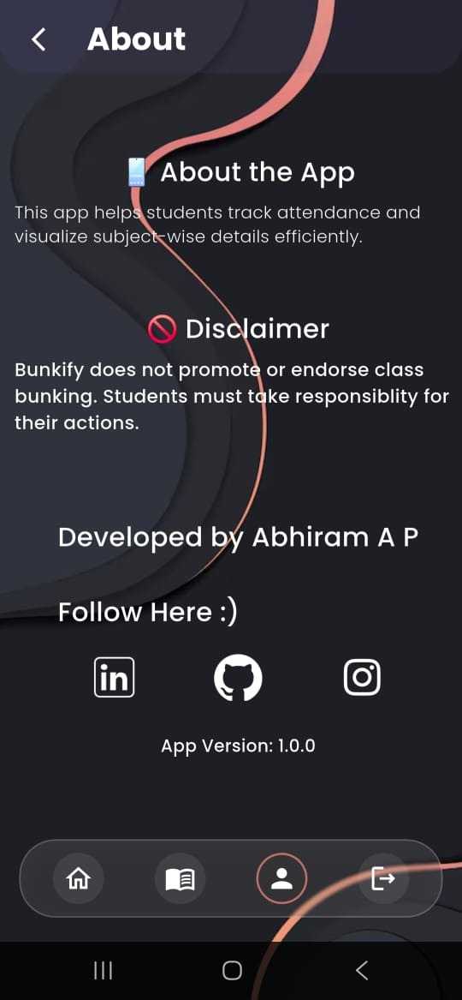
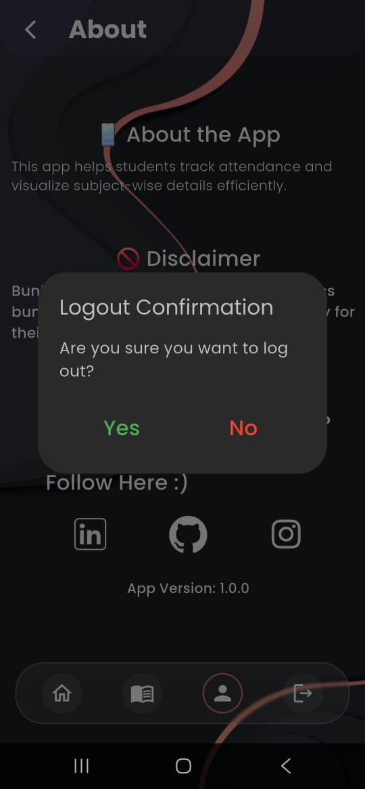

#  Bunkify

**Bunkify** is a smart attendance companion app that helps students strategically track their attendance and calculate how many classes they can safely bunk without dropping below their target threshold. Whether you're trying to maintain that 75% or push it further, Bunkify has got your back!

---

## GoTo:

- [Download](#download-bunkify)
  - [Requirements](#requirements)
- [About](#about)
- [Features](#features)
- [Screens](#screens)
- [Tech Stack](#tech-stack)
- [Bugs and Issues](#bugs-and-issues)
- [Contributing](#contributing)
- [Supporting](#supporting)

---

### Download Bunkify
Get the apk [here!](https://github.com/ABHIRAM-AP/Bunkify/releases/tag/bunkify_v1.0.0)

### Requirements
- Android 10 and above
- ~40 MB free space

---

## About
Bunkify is designed for students who want to track their attendance smartly. It helps calculate how many classes you can afford to miss ("bunk") while still maintaining your minimum attendance requirement. No more guesswork — just open Bunkify and plan smartly!

---

##  Features

-  Set your target attendance percentage
-  View total attended, conducted, and bunkable classes
-  Real-time calculation of bunkable classes per subject
-  Clean UI with student-friendly design
-  Local storage using SharedPreferences
-  Login system with session persistence

---

##  Screens

---

## Tech Stack

- **Flutter** — Cross-platform mobile framework
- **Dart** — Programming language for Flutter
- **Python (Flask)** — Backend API
- **BeautifulSoup, Requests** — Web scraping for attendance data
- **SharedPreferences** — Persistent local storage

---

##  Bugs and Issues
If you face any issues or bugs while using Bunkify, feel free to raise an [issue here](https://github.com/ABHIRAM-AP/Bunkify/issues).

---

## 🤝 Contributing
Want to help improve Bunkify? You're welcome to contribute:

- Fork the repo
- Make your changes
- Create a Pull Request

I'll review and merge it after verification!

---

## Supporting
If you find Bunkify useful, please consider starring the repository! It motivates further development and helps others discover the app.
